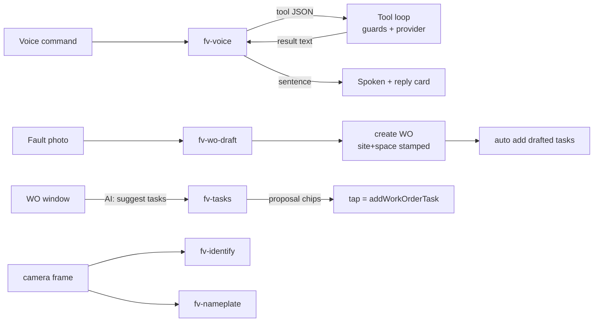

# Facilio Vision — the AI agentic flow

Five Studio agents, one client-side orchestrator, and a set of guarded tools.
The doctrine throughout: **agents decide, the app acts**. No agent holds org
credentials or server-side tools; every read and write runs in the client
through the provider seam, behind fabrication guards.

## The agents (Facilio Studio, org #2915)

| Agent | In → Out | Used by |
|---|---|---|
| `fv-voice` | CONTEXT + command (+ tool results) → ONE tool call **or** one spoken sentence | Effi's Ask/Directions, every voice command |
| `fv-wo-draft` | fault photo + context → `{subject, description, priority, tasks[]}` | Create work order (Effi, window, rail) — the WO arrives **executable**, checklist included |
| `fv-tasks` | WO subject/description + existing tasks → `{tasks[]}` (proposes what's MISSING) | "AI: suggest tasks" in the AR window's work-order view |
| `fv-identify` | photo + candidate refs → `{assetId\|none, confidence, reason}` | Find-the-asset confirmation, fault flow |
| `fv-nameplate` | photo → `{manufacturer, model, serial}` | Effi's Read nameplate |

## The orchestrator (src/voice/toolLoop.ts)

`fv-voice` runs a **client-side tool loop** (max 4 hops). Its reply is a
machine message: either a JSON tool call the loop executes, or the final
spoken sentence. Tools available to it:

```
find_asset {name}                 find_location {text}        ← sites/buildings/floors/spaces, name or id
find_work_order {text|#id}        get_work_order {workOrderId} ← full record + checklist
direction_to {kind, id}           navigate_to {assetId}        ← routing via the wayfinder graph
list_work_orders {assetId}        create_work_order {…}
add_tasks {workOrderId, tasks[]}  complete_task / reopen_task  change_status
```

### The guards (why the agent cannot go rogue)

- **Id whitelists**: `navigate_to`, `create_work_order`, `add_tasks` and
  `direction_to` accept only ids that a `find_*` tool surfaced **in this
  exchange** (or the record in view). An invented id gets an Error result the
  model must recover from.
- **Routing honesty**: the agent resolves *where*; the Dijkstra router
  computes *how*. An unmapped destination returns "not mapped", and the
  prompt forbids embellishing it.
- **Error results re-enter the transcript** as text, so the model reads what
  went wrong and self-corrects — one retry, never an identical call.

## Flows



- **"Take me to the fourth floor of tower A"** → `find_location` →
  `direction_to {kind:floor}` → route steps from the wayfinder graph, spoken.
- **"Status of work order 14275287"** → `find_work_order` resolves the bare
  number as an id (any status) → spoken summary.
- **"Add two tasks, check belt tension and grease the bearings"** →
  `add_tasks` on the WO in view → written via the script lane
  (`task.parentTicketId`, field confirmed in bmsconsole).
- **Photo → work order**: `fv-wo-draft` returns the checklist with the draft;
  the create stamps site + space and appends the tasks — the record arrives
  ready to execute.
- **"AI: suggest tasks"** on an existing WO: `fv-tasks` sees the existing
  checklist and proposes only what's missing; each proposal is a chip, each
  tap is one write.

## The training loop (how outputs get better)

Definitions live in `/agents/*.txt|.schema.json`; `node
tools/agent-eval/push.mjs` pushes them (round-trip verified); `node
tools/agent-eval/run.mjs [agent] --repeat N` scores live behaviour against
the scenario fixtures (`tools/agent-eval/fixtures.mjs`) using the same parse
helpers the app ships.

Lessons already encoded by this loop (kept because they were measured, not
guessed):

1. **Never reuse a real id in a prompt example** — the model parroted the
   example's answer for that id instead of calling the tool.
2. **Moralizing rules backfire** ("saying done without doing it is a lie"
   produced *more* narrated non-actions). What fixed it, measured 72%→100%:
   state the mechanics — "your reply is a machine message; plain text does
   nothing; only the JSON executes" — plus a decision procedure and
   contrastive WRONG/RIGHT examples.
3. **Schemas can't carry length bounds** server-side — every bound the
   prompt promises is re-enforced in the client validators (agents.ts).

Current scores (live, 2× samples): fv-voice **16/16 clean**, fv-tasks clean,
fv-wo-draft clean. Re-run after any prompt change; the exit code is CI-able.

## A race worth remembering

The QR lane used to mark a scan as consumed *before* it could act on it:
`lastQrAt.current = qrHit.at` ran on the effect's first pass, but both resolution
paths match the code against `surveys`, which is empty while its query is in
flight. A sticker scanned in the first moments after AR opened resolved to
nothing — and because the timestamp was already recorded, the effect never
retried it when the registry arrived. The scan was silently swallowed.

It does not show up in the field: the real scan loop re-emits every tick with a
fresh `at` while the code is in frame, so the next tick succeeds. A dropped first
scan is still half a second of a technician standing there wondering, so the
effect now waits for the registry rather than consuming a hit it cannot resolve.
`ar-maintenance-smoke.test.tsx` holds the surveys read open and asserts the
deferred hit is honoured.

**The lesson generalises: do not consume an event until the state you will
resolve it against has loaded.**

### …and a flake that looked like it, and wasn't

This bug was found while chasing an intermittent failure in the same test, and it
is worth recording that it was *not* the cause. The flake was in the harness: the
mocked scan loop assigns `scanBus.emit` from an effect, finding the "AR on"
button does not guarantee that effect has flushed, and the helper fired through
`scanBus.emit?.(...)`. When the mock was not yet armed, the optional call
**silently did nothing** — no scan, and an assertion failure that read exactly
like a broken app. Which interleaving you got depended on machine load: about one
full-suite run in five, never in isolation.

Two hypotheses were tested and disproved before instrumenting it — the app bug
above (fixing it did not move the failure rate) and a too-tight `findBy` budget
(measurement showed the chain at ~250 ms idle and ~600 ms under load, and raising
the budget changed nothing). Recording the actual state at the moment of failure
took one run and answered it immediately.

**Optional chaining on a test double hides the case where the double is not
ready.** Assert it is armed, then call it unconditionally.

That rule was applied to one call site first and the suite stayed flaky, because
the same `scanBus.emit?.(...)` appeared in three more places — in exactly the
files that were still failing. Every emit in the suite now waits for the mock.

Two other things were needed before the suite went quiet, both measured rather
than assumed:

- `estate-dispose.test.ts` builds a real engine per test, and an engine is a
  `requestAnimationFrame` loop doing per-frame work. Sixteen of them, in a file
  running in PARALLEL with everything else, is CPU contention that makes
  timing-sensitive tests elsewhere fail. Each is now parked at construction and
  disposed in `afterEach`.
- vitest's default 5 s `testTimeout` is genuinely too small here: the
  presence-decay test allows its own `waitFor` 4 s, so a boot plus a scan plus
  that retry nearly exhausts the budget before contention counts. The captured
  failure was literally "Test timed out in 5000ms".

Rate across the same 20-run stress: **10/20 → 3/20 → 0/20**.

## Platform notes

- "Agent teams" is not a Studio primitive — the tool loop IS the team:
  fv-voice orchestrates, the specialists (draft/tasks/identify/nameplate) are
  invoked by the app at the right moments, and the client owns every write.
- Agents run on `openai/gpt-5.5` (platform default for this org).
