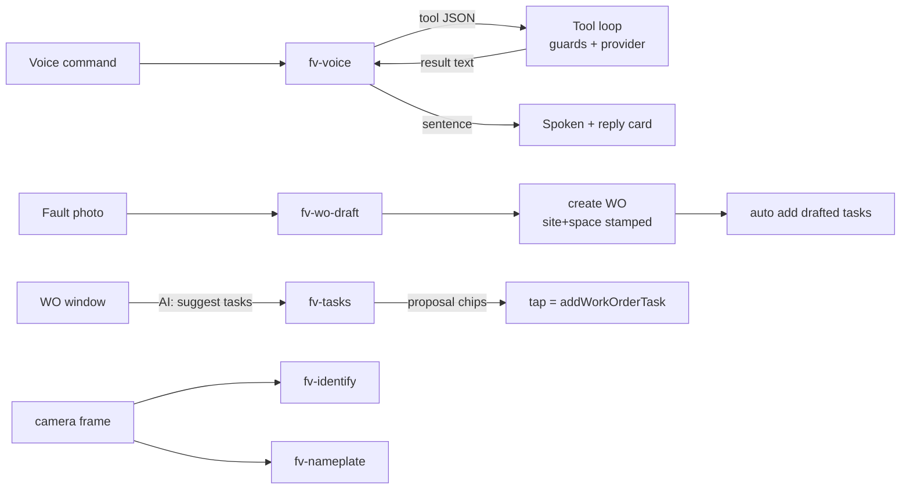

# Facilio Vision — the AI agentic flow

Five Studio agents, one client-side orchestrator, and a set of guarded tools.
The doctrine throughout: **agents decide, the app acts**. No agent holds org
credentials or server-side tools; every read and write runs in the client
through the provider seam, behind fabrication guards.

## The agents (Facilio Studio, org #2915)

| Agent | In → Out | Used by |
|---|---|---|
| `fv-voice` | CONTEXT + command (+ tool results) → ONE tool call **or** one spoken sentence | Effi's Ask/Directions, every voice command |
| `fv-wo-draft` | fault photo + context → `{subject, description, priority, tasks[]}` | Create work order (Effi, window, rail) — the WO arrives **executable**, checklist included |
| `fv-tasks` | WO subject/description + existing tasks → `{tasks[]}` (proposes what's MISSING) | "AI: suggest tasks" in the AR window's work-order view |
| `fv-identify` | photo + candidate refs → `{assetId\|none, confidence, reason}` | Find-the-asset confirmation, fault flow |
| `fv-nameplate` | photo → `{manufacturer, model, serial}` | Effi's Read nameplate |

## The orchestrator (src/voice/toolLoop.ts)

`fv-voice` runs a **client-side tool loop** (max 4 hops). Its reply is a
machine message: either a JSON tool call the loop executes, or the final
spoken sentence. Tools available to it:

```
find_asset {name}                 find_location {text}        ← sites/buildings/floors/spaces, name or id
find_work_order {text|#id}        get_work_order {workOrderId} ← full record + checklist
direction_to {kind, id}           navigate_to {assetId}        ← routing via the wayfinder graph
list_work_orders {assetId}        create_work_order {…}
add_tasks {workOrderId, tasks[]}  complete_task / reopen_task  change_status
```

### The guards (why the agent cannot go rogue)

- **Id whitelists**: `navigate_to`, `create_work_order`, `add_tasks` and
  `direction_to` accept only ids that a `find_*` tool surfaced **in this
  exchange** (or the record in view). An invented id gets an Error result the
  model must recover from.
- **Routing honesty**: the agent resolves *where*; the Dijkstra router
  computes *how*. An unmapped destination returns "not mapped", and the
  prompt forbids embellishing it.
- **Error results re-enter the transcript** as text, so the model reads what
  went wrong and self-corrects — one retry, never an identical call.

## Flows



- **"Take me to the fourth floor of tower A"** → `find_location` →
  `direction_to {kind:floor}` → route steps from the wayfinder graph, spoken.
- **"Status of work order 14275287"** → `find_work_order` resolves the bare
  number as an id (any status) → spoken summary.
- **"Add two tasks, check belt tension and grease the bearings"** →
  `add_tasks` on the WO in view → written via the script lane
  (`task.parentTicketId`, field confirmed in bmsconsole).
- **Photo → work order**: `fv-wo-draft` returns the checklist with the draft;
  the create stamps site + space and appends the tasks — the record arrives
  ready to execute.
- **"AI: suggest tasks"** on an existing WO: `fv-tasks` sees the existing
  checklist and proposes only what's missing; each proposal is a chip, each
  tap is one write.

## The training loop (how outputs get better)

Definitions live in `/agents/*.txt|.schema.json`; `node
tools/agent-eval/push.mjs` pushes them (round-trip verified); `node
tools/agent-eval/run.mjs [agent] --repeat N` scores live behaviour against
the scenario fixtures (`tools/agent-eval/fixtures.mjs`) using the same parse
helpers the app ships.

Lessons already encoded by this loop (kept because they were measured, not
guessed):

1. **Never reuse a real id in a prompt example** — the model parroted the
   example's answer for that id instead of calling the tool.
2. **Moralizing rules backfire** ("saying done without doing it is a lie"
   produced *more* narrated non-actions). What fixed it, measured 72%→100%:
   state the mechanics — "your reply is a machine message; plain text does
   nothing; only the JSON executes" — plus a decision procedure and
   contrastive WRONG/RIGHT examples.
3. **Schemas can't carry length bounds** server-side — every bound the
   prompt promises is re-enforced in the client validators (agents.ts).

Current scores (live, 2× samples): fv-voice **16/16 clean**, fv-tasks clean,
fv-wo-draft clean. Re-run after any prompt change; the exit code is CI-able.

## Platform notes

- "Agent teams" is not a Studio primitive — the tool loop IS the team:
  fv-voice orchestrates, the specialists (draft/tasks/identify/nameplate) are
  invoked by the app at the right moments, and the client owns every write.
- Agents run on `openai/gpt-5.5` (platform default for this org).
